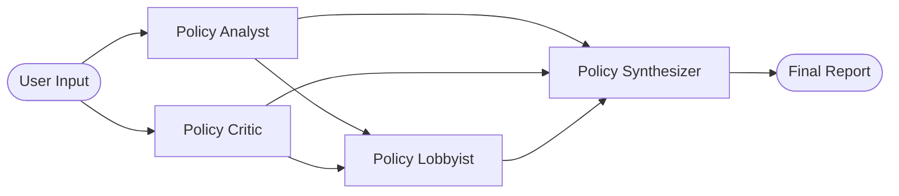

# Popu Agent - Data-Driven Policy Analyzer

Popu Agent is a multi-agent policy analysis system built with Google ADK and Gemini.

## Overview

The app runs four specialized agents in sequence:

1. Analyst: 360-degree policy analysis with data points.
2. Critic: downside/risk analysis and failed examples.
3. Lobbyist: three actionable policy directives.
4. Synthesizer: executive summary with verdict, data, risks, and roadmap.

## Architecture



## Prompt Configuration (New)

Agent system prompts are loaded at runtime from:

- `skills/policy-prompt-author/references/prompts.json`

Runtime loader:

- `agents/prompt_store.py`

Agent wiring:

- `agents/analyst.py` -> `get_agent_instruction("analyst")`
- `agents/critic.py` -> `get_agent_instruction("critic")`
- `agents/lobbyist.py` -> `get_agent_instruction("lobbyist")`
- `agents/synthesizer.py` -> `get_agent_instruction("synthesizer")`

To change live prompt behavior, edit `prompts.json`.

## Installation

This project targets Python 3.11+.

Install dependencies:

```bash
pip install -r requirements.txt
```

Dependencies:

- `google-adk>=0.0.1`
- `google-generativeai>=0.3.0`
- `tavily-python>=0.3.0`
- `gradio>=4.0.0`
- `python-dotenv>=1.0.0`

## API Keys

Create `.env` in project root:

```env
GOOGLE_API_KEY=your_google_api_key_here
TAVILY_API_KEY=your_tavily_api_key_here
```

## Running the App

Standard:

```bash
python main.py
```

If your default Python does not have dependencies installed:

```bash
.\popu_agent_env\Scripts\python.exe main.py
```

The app launches a Gradio UI (typically `http://127.0.0.1:7860`).

## Project Structure

- `main.py`: App orchestration and Gradio UI.
- `config.py`: Runtime configuration and environment reads.
- `tools.py`: Tool integrations (search/data fetch helpers).
- `agents/prompt_store.py`: Central runtime prompt loader.
- `agents/analyst.py`: Analyst agent factory.
- `agents/critic.py`: Critic agent factory.
- `agents/lobbyist.py`: Lobbyist agent factory.
- `agents/synthesizer.py`: Synthesizer agent factory.
- `skills/policy-prompt-author/SKILL.md`: Local skill for prompt authoring workflow.
- `skills/policy-prompt-author/references/prompts.json`: Runtime prompt source.
- `skills/policy-prompt-author/references/prompts.md`: Human-readable prompt inventory.
- `images/`: Agent visualization assets.

## Workflow

1. Analyst and Critic run in parallel.
2. Lobbyist uses Analyst + Critic outputs.
3. Synthesizer summarizes all outputs.
4. User can download a Markdown report from the UI.
